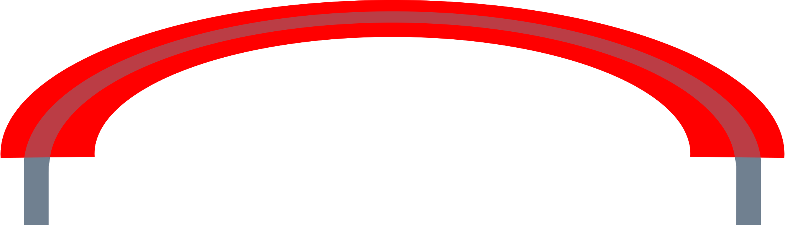

# MicrocontrollerPlayground

A collection of scripts used in combination with various micro controllers (and a Raspberry Pi utilizing it's GPIO pins and `systemd`).

## Setup

### Linux (e.g. Arch/Manjaro)

#### Permissions to write to Microcontrollers


```sh
# Find device
ls /dev/ttyACM*
ls /dev/ttyUSB*
# Give user write permissions:
# e.g. /dev/ttyACM0: (Arduino UNO R3)
sudo chmod a+rw /dev/ttyACM0
```

The permissions can also be done permanently by adding the current user to the `uucp` group (provides access to serial ports, USB serial devices, etc.):

```sh 
sudo usermod -a -G uucp $USER
```

## Basics

### Prototyping Tools

#### Breadboard

A breadboard is a reusable platform for quickly building and testing electronic circuits without soldering.

The holes on the outer 2 columns are vertically connected while the ones in the 2 inner columns are connected horizontally (sometimes the red and blue lines have a space in the middle meaning that there the lines are disconnected).


#### Jumper Cables

A jumper cable is an insulated wire (which is able to conduct electricity) with an exposed connector on both endings.
Plugging the connectors inside the holes of a breadboard makes it possible to create quickly electrical connections between components.
The insulation is important to prevent accidental contact with other wires (or other electrical conducting components) and electrical shocks.

> [!IMPORTANT]  
> Humans generally cannot get an electric shock from extra-low voltage systems (like the 5V output of a Raspberry Pi) as the voltage is too low to overcome the resistance of human skin under normal conditions.
>
> $16mA$ is the most a human can experience while still being able to let go and not take permanent damage.
>
> Still the resistance of human skin drops dramatically when being wet or damaged to as low as $500\Omega-1k\Omega$[^1]
>
> $$
> \overbrace{I\text{ (Current)} = \dfrac{V\text{ (Voltage)}}{R \text{ (Resistance)}}}^\text{Ohm's law}:
> $$
>
> $$
> \begin{aligned}
> \dfrac{5V\text{ (Voltage Raspberry Pi)}}{100k\Omega \text{ (Resistance human dry skin)}} &= 50 \mu A \text{ (harmless)}\\
> \dfrac{5V\text{ (Voltage Raspberry Pi)}}{1k\Omega \text{ (Resistance human wet skin)}} &= 5 mA \text{ (noticeable but not yet dangerous)}\\
> \end{aligned}
> $$
>

[^1]: https://www.cdc.gov/niosh/docs/98-131/ Publication No. 98-131: Worker Deaths by Electrocution (PDF). National Institute for Occupational Safety and Health. Retrieved 2024-12-14. (archived: https://web.archive.org/web/20081011191854/http://www.cdc.gov/niosh/docs/98-131/pdfs/98-131.pdf)



### Theory

#### Electric Current

Electric current is the flow of electric charge (usually electrons) through a conductor like a wire.

TODO

#### Conductor

TODO

#### Ohm's Law

Ohm's law describes the relationship between voltage, current, and resistance in a circuit:
$$
I(\text{Current in amperes }[A]) = \dfrac{V(\text{Voltage in volts }[V])}{R (\text{Resistance in ohms}[\Omega])}
$$

#### Power

It’s how much energy is used per unit of time:
$$
P (\text{Power in watts}[W]) = V(\text{Voltage in volts }[V]) \cdot I(\text{Current in amperes }[A])
$$

#### Kirchhoff's circuit laws

Kirchhoff's circuit laws are two equalities that deal with the current and potential difference (commonly known as voltage) in the lumped element model of electrical circuits.

TODO

#### AC/DC

TODO

### Basic Electronic Components

#### Resistor

A resistor is an electronic component that limits or regulates the flow of electrical current in a circuit.
It is used to control voltage and current levels, protect components from excessive current, and create voltage drops.

#### Capacitor

Stores and releases electrical energy; often used for smoothing voltage or timing circuits.

#### Diode

Allows current to flow in only one direction, commonly used in rectifiers.

#### Transistor

Acts as a switch or amplifier in circuits, key to microcontroller operation.

#### Advanced Electronic Components

#### LED

TODO (RGB LED)

#### Button

TODO

### Communication Protocols

Microcontrollers communicate with other devices using the following protocols (they define how data is transmitted and received using electrical signals):

#### I2C ($I^2C$)

TODO

#### SPI

TODO

#### UART

TODO

### Microcontroller Inputs/Outputs

#### Output Pins

TODO (High/Low, PWM, Digital, Analog)

#### Input Pins

TODO (Digital, Analog Inputs)

## Sensors

### DHT22

TODO

### LCD Display

TODO

...
