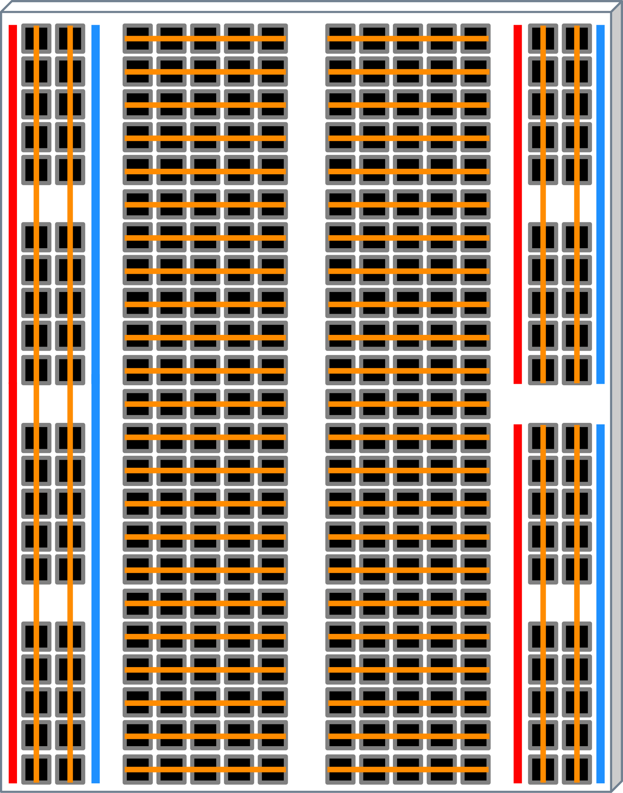

# ArduinoPlayground

A collection of scripts used in combination with an Arduino UNO R3.

## Setup

### Linux (`pacman` e.g. Arch/Manjaro)

1. Install the Arduino IDE (v2)

   ```sh
   sudo pacman -S arduino-ide
   ```

2. Install `avrdude`

   ```sh
   sudo pacman -S avrdude
   ```

3. Give permission to write to the Arduino (needs to be done every restart)

   ```sh
   ls /dev/ttyACM*
   # should list: /dev/ttyACM0
   sudo chmod a+rw /dev/ttyACM0
   # adds read + write permissions to the arduino device
   ```

   > This is only necessary in case you get the following error when uploading:
   >
   > ```txt
   > avrdude: ser_open(): can't open device "/dev/ttyACM0":  Permission denied
   > Failed uploading: uploading error: exit status 1
   > ```

Then you can open the *Arduino IDE (v2)* and compile/send programs to the with USB connected *Arduino UNO R3*.

> [!NOTE]
>
> In the case that something breaks you can reset the IDE by closing it, removing all associated files (e.g. `~/.arduino15`, `~/.arduinoIDE`, `~/.config/arduino-ide`) and then restarting it.
> (one example of when such a case is warranted is a never closing notification `downloading index: package_index.tar.bz2` that makes you unable to compile programs)

## Basics

### Breadboard

A breadboard is a reusable platform for quickly building and testing electronic circuits without soldering, making it ideal for prototyping and experimenting with different circuit designs.

The outer 2 columns are vertically connected while the inner columns are connected horizontally.



## CLI

Setup board:

```sh
arduino-cli core update-index
# Downloading index: package_index.tar.bz2 downloaded
arduino-cli board list
# Port         Protocol Type              Board Name  FQBN            Core
# /dev/ttyACM0 serial   Serial Port (USB) Arduino Uno arduino:avr:uno arduino:avr
arduino-cli core install arduino:avr
# Platform arduino:avr@1.8.6 already installed
arduino-cli core list
# ID          Installed Latest Name
# arduino:avr 1.8.6     1.8.6  Arduino AVR Boards
```

Setup project:

```sh
# => Create new project/Sketch in the directory 'simple_led_blink'
arduino-cli sketch new simple_led_blink
#  Sketch created in: /home/$USER/Documents/.../simple_led_blink
```

Compile and upload project:

```sh
# => Sketch is located in the directory 'simple_led_blink'
arduino-cli compile --fqbn arduino:avr:uno simple_led_blink
# Sketch uses 3626 bytes (11%) of program storage space. Maximum is 32256 bytes.
# Global variables use 236 bytes (11%) of dynamic memory, leaving 1812 bytes for local variables. Maximum is 2048 bytes.
#
# Used platform Version Path
# arduino:avr   1.8.6   /home/$USER/.arduino15/packages/arduino/hardware/avr/1.8.6
# => Arduino board is located in the directory /dev/ttyACM0
arduino-cli upload -p /dev/ttyACM0 --fqbn arduino:avr:uno simple_led_blink
```

Read the serial port output:

```sh
arduino-cli monitor -p /dev/ttyACM0
# or
arduino-cli monitor -p /dev/ttyACM0 --config 9600
# Using default monitor configuration for board: arduino:avr:uno
# Monitor port settings:
#   baudrate=9600
#   bits=8
#   dtr=on
#   parity=none
#   rts=on
#   stop_bits=1
#
# Connecting to /dev/ttyACM0. Press CTRL-C to exit.
# LED_BUILTIN is the pin 13
# LED ON
# LED OFF
# LED ON
# LED OFF
```

> [!NOTE]
>
> When monitoring a devices serial port no upload can be made to the device until after the serial port monitor is closed again
