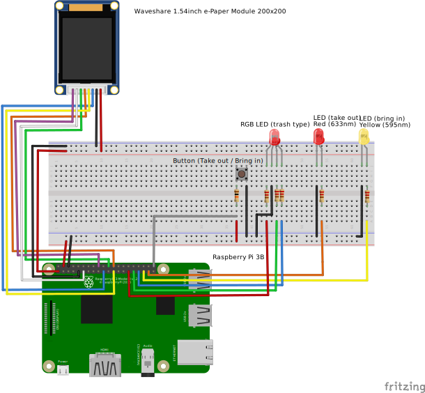
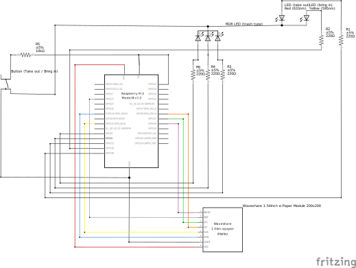

# 01_trash_notifier_e_ink

Fetches the current trash dates and displays them on a e-ink display.
The day before it turns on the Red LED to bring out the trash plus a trash color using the RGB LED.
If the button is pressed (*take out*) it turns both of them off and turns the yellow LED on the next day.
If the button is now pressed (*brought in*) it turns the yellow LED off again.





```sh
# Start
CALENDAR_URL="https://api.abfall.io/?key=INSERT_CUSTOM&mode=export&idhousenumber=INSERT_CUSTOM&wastetypes=INSERT_CUSTOM&showinactive=false&type=ics" python main.py
# Get journal logs
journalctl SYSLOG_IDENTIFIER=trash_notifier -f
```

`systemd` service description: (`.config/systemd/user/trash_notifier.service` for the user `niklas`)

```sh
[Unit]
Description=Trash notifier
After=default.target

[Service]
ExecStart=/home/niklas/Documents/01_trash_notifier/venv_test/bin/python3 /home/niklas/Documents/01_trash_notifier/main.py
WorkingDirectory=/home/niklas/Documents/01_trash_notifier
StandardOutput=journal
StandardError=journal
Restart=always
Environment="https://api.abfall.io/?key=INSERT_CUSTOM&mode=export&idhousenumber=INSERT_CUSTOM&wastetypes=INSERT_CUSTOM&showinactive=false&type=ics"

[Install]
WantedBy=default.target
```

