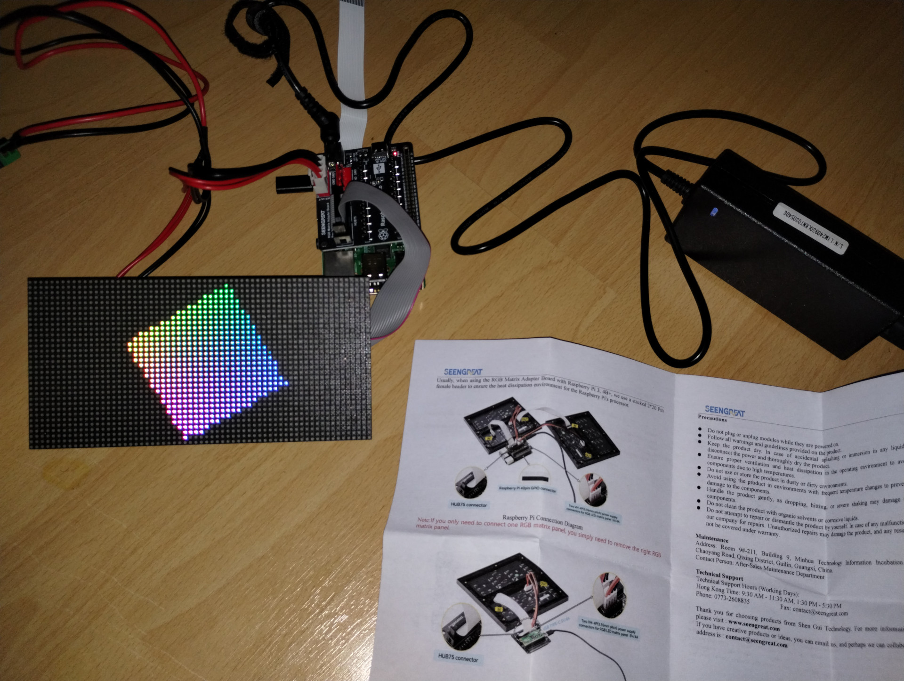

# LED Wall



## Hardware

- HUB75 compatible panel: [Waveshare RGB Full-Colour LED Matrix Panel 2.5mm Pitch 64x32 Pixels](https://www.amazon.de/-/en/dp/B0BQYDLHY9) 30€
- HUB75 interface: [RGB Matrix Adapter Board for Raspberry Pi Motherboards and Pico 1](https://www.amazon.de/dp/B0BC8Y447G) 20€
- 5V/4A (20W) Power Supply: [LEICKE Ull Universal Power Supply, 5.5x2.5mm Plug](https://www.amazon.de/-/en/dp/B01HRR9GY4) 15€

## Software

```sh
git clone https://github.com/hzeller/rpi-rgb-led-matrix.git
cd rpi-rgb-led-matrix
# Build
make -j4
# Run demos (exit with Ctrl+D)
cd examples-api-use
# Demos, chosen with -D
#         0  - some rotating square
#         1  - forward scrolling an image (-m <scroll-ms>)
#         2  - backward scrolling an image (-m <scroll-ms>)
#         3  - test image: a square
#         4  - Pulsing color
#         5  - Grayscale Block
#         6  - Abelian sandpile model (-m <time-step-ms>)
#         7  - Conway's game of life (-m <time-step-ms>)
#         8  - Langton's ant (-m <time-step-ms>)
#         9  - Volume bars (-m <time-step-ms>)
#         10 - Evolution of color (-m <time-step-ms>)
#         11 - Brightness pulse generator
#         12 - Colorful rotating 3d cube
sudo ./demo -D 0 --led-cols=64 --led-no-hardware-pulse
sudo ./text-example -f ../fonts/6x13.bdf --led-cols=64 --led-no-hardware-pulse
# Enter text
sudo ./clock -f ../fonts/6x13.bdf --led-cols=64 --led-no-hardware-pulse 
```
