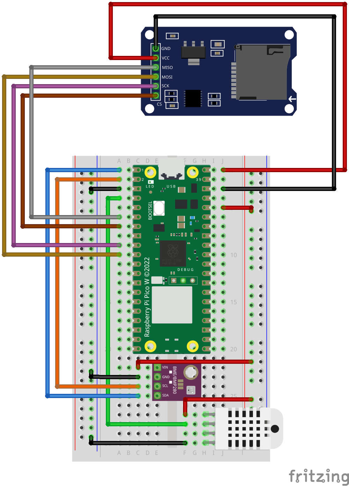

# 02_outdoor_weather

Reads DHT22 temperature and humidity and implements a webserver endpoint to request data points and a website to see data points.

## Misc

### ETag support

Every JSON request response contains an `ETag` header which is a hash of the JSON data to be returned.
In the case that a HTTP request is conditional (e.g. the request has the header `If-None-Match: "INSERT_ETAG"`) and no new data is available (the including `ETag` value is the same as the current one) a `304  Not Modified` HTTP response is sent.

To test this the JavaScript code [`json_etag_test.js`](./test/json_etag_test.js) can be run with Node.js (e.g. `node json_etag_test.js`) after updating the IP to the one of your Raspberry Pi Pico W.
