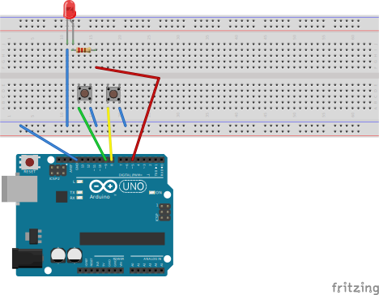
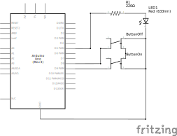

# simple_led_button

The LED can be turned off and on again by reading button presses using digital inputs.

> [!NOTE]
>
> Add information about what a pullup resistor is and why you do not need one since the Arduino has it integrated.
