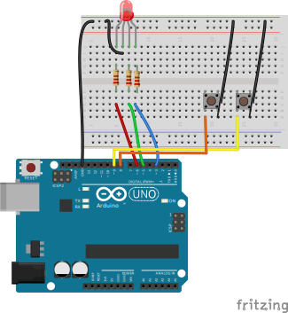
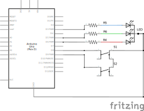

# simple_led_button_rgb

The RGB LED cycles through it's colors but can be turned off (and stopped) using a `OFF` button.
When the other button is pressed the LEDs turn `ON` again and resume the color cycle.

