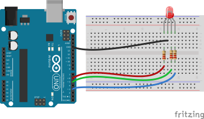
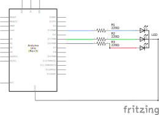

# simple_led_rgb

The program has a serial output on LED `RED`/`GREEN`/`BLUE` which can be inspected using the *Serial Monitor* (`Ctrl` + `Shift` + `M`).

The RGB LED is changing it's color over time in a loop from red to green, from green to blue and from blue to red.

